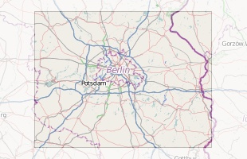
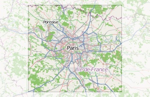

# Spatial databases: Project

Yves Müller (uves@spline.de)

Philipp Borgers (borgers@mi.fu-berlin.de)

---
# Requirements

* overlay of city maps
* based on osm data
* stored in PostGIS

---
# Procedure

* fetch osm data
* extract city maps
* convert data to PostGIS
* compute centroid and contour
* overlay maps

---
# Part 1

* **fetch osm data**
* extract city maps
* convert data to PostGIS
* compute centroid and contour
* overlay maps

---
# Choice: OSM data formats

* OMS-XML
    * gzip
    * xml
* PBF
    * binary ( [googles protocoll buffer](https://code.google.com/p/protobuf/) )
    * streamable
* o5m
    * binary ( also protobuf)
    * but different structure

---

# Why did we use the XML Format?

* we have mirroed these files at [spline](http://ftp.spline.inf.fu-berlin.de/pub/openstreetmap)
* our import tool works best with it
* pbf was not offerd by extractotron (see below)

---
# Elementary Objects

* nodes
    * corrdinates
    * decriptive attributes
* ways
    * list of nodes
    * decriptive attributes
* ( polygons )
    * represented as closed ways
* relations
    * ordered set of nodes and points
    * decriptive attributes

## &rArr; spagetti model

---
# Part 2:

* fetch osm data
* **extract city maps**
* convert data to PostGIS
* compute centroid and contour
* overlay maps
---
# First approach: Extract vom planet dump

* very time consuming
    * importing data for europe takes around 1,5 weeks
    * filtering citydata will be of same magnitude

---
# Extractotron

* toolchain to extract various cities
* takes bbox as input
* returns data ready for import
* already processed [city data](http://metro.teczno.com/) avaiable

---
# Part 3

* fetch osm data
* extract city maps
* **convert data to PostGIS**
* compute centroid and contour
* overlay maps

---
# Choice: Import tool

* osmosis
    * feature rich (different outputs + filters)
    * written in java
    * much more than a import tool
* osm2pgsql
    * output suitable for rendering
    * written in c
* '' we used osm2pgsql ''
    * simpler
    * faster

---
# Database schema

* rendering schema
* schema:
    * planet_osm_polygon
        * planet_osm_polygon(bigint osm_id, geometry way, text tag0, ...)
    * planet_osm_point, planet_osm_line, planet_osm_roads
* polygon is of most intrest for us, because city boundries are stored in this tabel

---
# Part 4

* fetch osm data
* extract city maps
* convert data to PostGIS
* **compute centroid and contour**
* overlay maps

---
# Computation in PostGIS

## extraction of contour
* straight forward (select from table)
* transform to usefull projection
* output as GEOJson
* (berlin is replaced with the city given by the client)

## Example: Extract contour of Berlin

    !sql
    SELECT ST_AsGEOJson(ST_Transform(way,4326))
    FROM planet_osm_polygon
    WHERE boundary = 'administrative' and name = 'berlin'

---
# Computation in PostGIS (cont'd)

## computation of centroid
* similar
* requires extra function application

## Example: Compute centroid of Berlin

    !sql
    SELECT ST_AsGEOJson(ST_Transform(ST_Centroid(way),4326))
    FROM planet_osm_polygon
    WHERE boundary = 'administrative' and name = 'berlin'

---
# Computation in PostGIS (cont'd)

## translation of a polygon
* x and y given by the client (could be centroid of another city)
* there maybe to many ST_Transformation calls in this code

## Example:
    !sql
    ST_AsGeoJSON(ST_Translate(
        ST_Transform(way,4326),
            #{x}-ST_X(ST_Transform(ST_Centroid(way),4326)),
            #{y}-ST_Y(ST_Transform(ST_Centroid(way),4326))
        ))
    FROM planet_osm_polygon
    WHERE boundary = 'administrative' and name = 'berlin'

---
# Caution: geography vs geometry

* sometimes functions need PostGIS geography object

## Example: Compute area of Berlin
    !sql
    SELECT ST_Area(Geography(ST_Transform(way, 4326)))
    FROM planet_osm_polygon
    WHERE boundary = 'administrative' and name = 'berlin'

---
# Part 5

* fetch osm data
* extract city maps
* convert data to PostGIS
* compute centroid and contour
* **overlay maps**

---

# Architecture

---

# Software stack (server)

* node.js
* express
    * http framework
* (node-)postgres
    * storage
* postgis

---
# Software stack (client)

* leaflet
    * slippy map
    * rendering
* jquery
    * ajax requests

---
# Why didn't we use qgis?

* we wanted to do something different
* coding js is a great fun for us

---

# Implementation

---

#API (REST-Endpoints and thier return values)

`GET /api/cities/:name`

    !javascript
    {
        'type': 'FeatureCollection',
        'features': [
            {
                'type': 'Feature',
                'geometry': geoJsonGeometry,
                'properties': {
                    'name': 'Berlin',
                    'centroid': <geoJsonGeometry>,
                    'area': 1234
                }
            }
        ]
    }

---

#API (overlay)

`GET /api/cities/:name?translate=0,0`

    !javascript
    {
        'type': 'FeatureCollection',
        'features': [
            {
                'type': 'Feature',
                'geometry': <translatedGeoJsonGeometry>,
                'properties': {
                    'name': 'Berlin',
                    'centroid': <geoJsonGeometry>,
                    'area': 1234
                }
            }
        ]
    }

---

# GEOJson Geometry

    !javascript
    {
        "type": "Polygon",
        "coordinates": [
            [ [100.0, 0.0], [101.0, 0.0], [101.0, 1.0], [100.0, 1.0], [100.0, 0.0] ],
            [ [100.2, 0.2], [100.8, 0.2], [100.8, 0.8], [100.2, 0.8], [100.2, 0.2] ]
        ]
    }

---
# Live demo

---
# Things that are missing

* we need a nice interface for the client
* queries to the http api should be dynamic not static
    * means based on user input, not hardcoded

---
# The end
